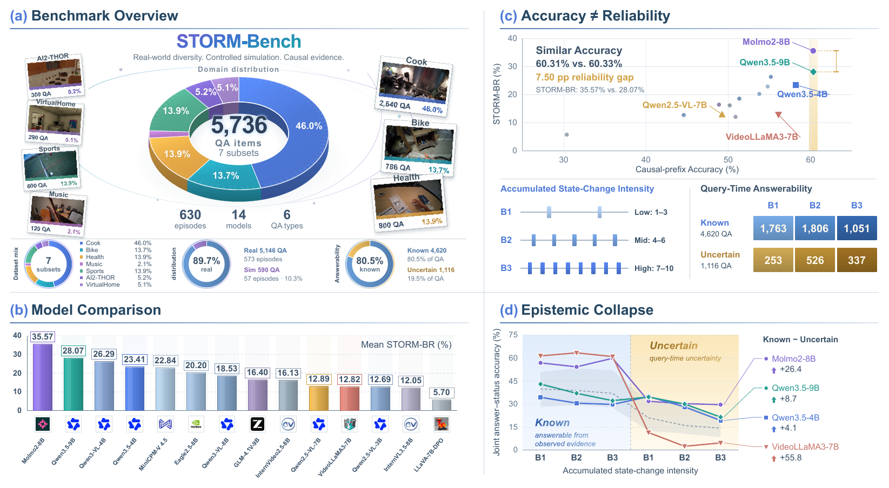
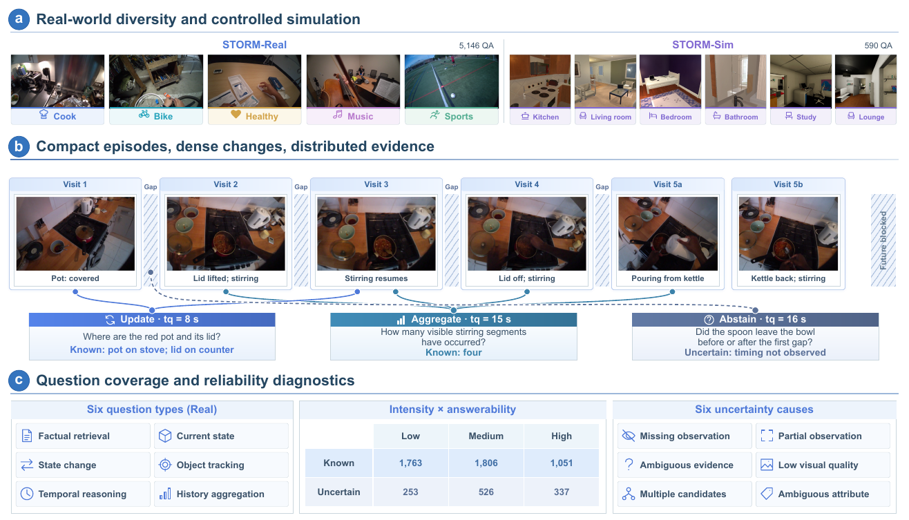
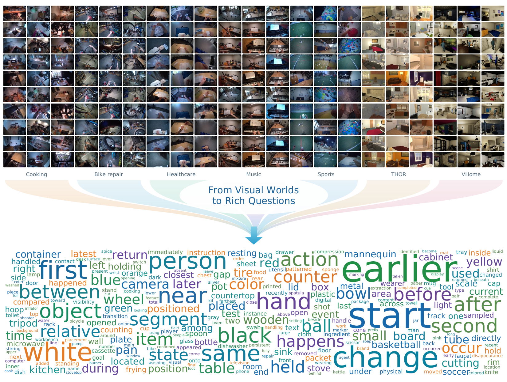
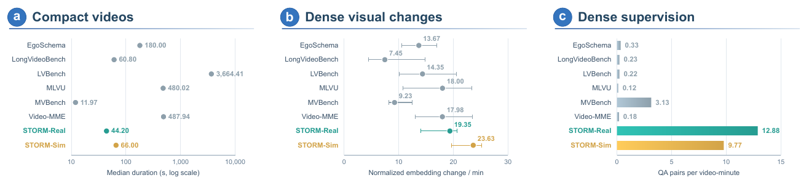
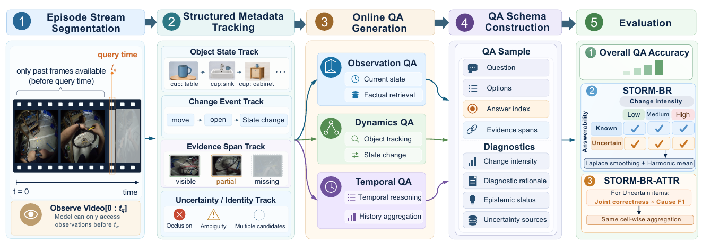
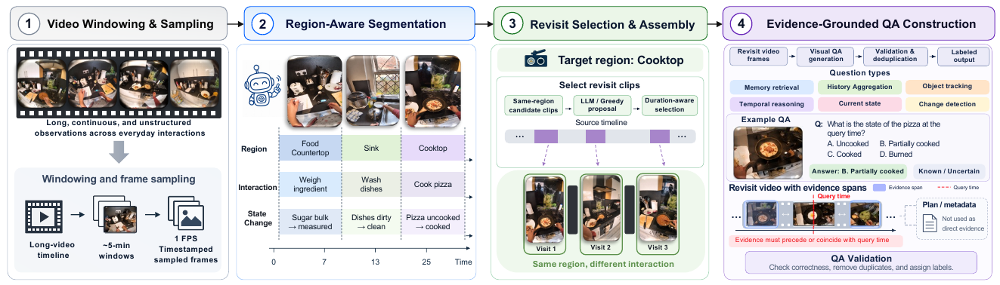
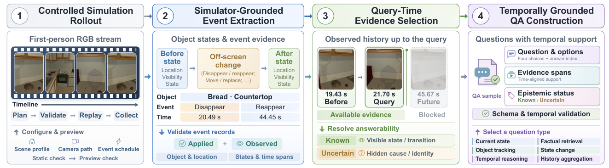

# STORM-Bench

**Evaluating Online Video QA under Evolving and Incomplete Evidence**

[Dataset on Hugging Face](https://huggingface.co/datasets/Storm-Bench/Storm-Bench) · [Data format](data/README.md) · [Evaluation guide](scripts/eval/README.md)

STORM-Bench tests whether video models can track changing states, combine observations over time, and abstain when evidence is insufficient. At each query time, the model sees only the observed video prefix, sampled at **1 FPS**.

The full benchmark contains **5,736 questions across 630 episodes**, spanning five real-world domains and two simulation backends. Every question includes four answer options, temporal evidence, change intensity, and answerability diagnostics.



## Dataset



*Figure 3. Domains, causal query examples, question types, and diagnostics across the full benchmark.*

| Track | Subset | Source | Questions | Episodes |
| --- | --- | --- | ---: | ---: |
| Real | Cook | HD-EPIC | 2,640 | 314 |
| Real | Bike Repair | Ego-Exo4D | 786 | 61 |
| Real | Health | Ego-Exo4D | 800 | 83 |
| Real | Music | Ego-Exo4D | 120 | 16 |
| Real | Sports | Ego-Exo4D | 800 | 99 |
| Sim | THOR | AI2-THOR | 300 | 28 |
| Sim | VHome | VirtualHome | 290 | 29 |
| **Total** | | | **5,736** | **630** |

This repository contains annotations for all seven subsets, video manifests, example clips, evaluation code, and construction pipelines. The [Hugging Face package](https://huggingface.co/datasets/Storm-Bench/Storm-Bench) currently provides videos and annotations for the five real-world subsets and THOR: **5,446 questions / 601 episodes**. VHome annotations and an example clip are available here.

The two releases use different episode identifiers and media layouts. Use each release's matching annotations and videos; see [GitHub data layout](data/README.md) and the [dataset card](https://huggingface.co/datasets/Storm-Bench/Storm-Bench).

## Visual worlds and question coverage



*Figure 2. Video examples from all seven subsets and the vocabulary of their questions.*



*Figure 4. Compact videos, dense visual changes, and dense QA supervision. Dots and bars show medians; error bars in the middle panel show interquartile ranges.*

## Online evaluation



Queries cover factual retrieval, current state, state change, object tracking, temporal reasoning, and history aggregation. Questions are grouped by **change intensity** (Low / Medium / High) and **answerability** (Known / Uncertain).

- **Accuracy** measures the task answer.
- **STORM-BR** measures joint answer–status correctness, balancing occupied intensity–answerability cells with Laplace smoothing and a harmonic mean.
- **STORM-BR-ATTR** additionally scores uncertainty-cause attribution on Uncertain questions using multi-label F1 and unsmoothed cell means.

The answerability probe uses the same observed prefix and question **without the task options**. Ground-truth answers, evidence, and diagnostic labels are reserved for scoring. The full protocol and scoring details are in the [evaluation guide](scripts/eval/README.md).

## Quick start

Clone the code:

```bash
git clone https://github.com/siruzhong/STORM-Bench.git
cd STORM-Bench
```

Download a domain from the dataset repository:

```bash
pip install -U huggingface_hub datasets
hf download Storm-Bench/Storm-Bench --repo-type dataset \
  --include "storm_bike/**" --local-dir data/hf
```

See the [dataset card](https://huggingface.co/datasets/Storm-Bench/Storm-Bench) for annotation loading and the packaged video layout. Authenticate with `hf auth login` if access requires it.

For the GitHub evaluation annotations, prepare media according to [`data/manifests/`](data/manifests/) and follow the [environment and checkpoint setup](scripts/eval/README.md). Run the online protocol with independent diagnostic probes:

```bash
python scripts/eval/run_storm_models.py \
  --models qwen3_vl_8b --protocols online --with-status \
  --checkpoint-root ckpt \
  --gt-file data/annotations/storm_bike.questions.jsonl \
  --video-root /path/to/storm_bike/video
```

Score existing predictions:

```bash
python scripts/eval/score_storm_diagnostics.py \
  --gt-file data/annotations/storm_bike.questions.jsonl \
  --pred-file outputs/storm_bench/models/online/qwen3_vl_8b/pred.jsonl
```

## Layout

```text
STORM-Bench/
├── data/
│   ├── annotations/    # Seven subset JSONL files
│   ├── manifests/      # Episode IDs, video paths, query timestamps
│   ├── splits/         # Simulation split and protocol definitions
│   └── examples/       # Example videos with matching questions
├── scripts/eval/       # Model runners, causal sampling, diagnostics, scoring
├── storm-real/         # Real-world episode and QA construction
├── storm-sim/          # THOR and VirtualHome construction
└── docs/assets/        # Figures from the paper
```

## Dataset construction

### STORM-Real

Region-aware timelines identify repeated visits to the same functional area. Chronologically ordered clips form compact episodes, followed by query-time QA generation and evidence validation.



[Real-world pipeline and commands →](storm-real/README.md)

### STORM-Sim

Controlled rollouts link physical events to observed evidence. Query selection enforces the causal cutoff, and question builders attach answer options, evidence spans, and diagnostic labels.



[THOR and VirtualHome pipeline and commands →](storm-sim/README.md)

## Data sources and attribution

Real-world subsets derive from [HD-EPIC](https://hd-epic.github.io/) and [Ego-Exo4D](https://ego-exo4d-data.org/); simulation subsets use [AI2-THOR](https://ai2thor.allenai.org/) and [VirtualHome](https://www.virtual-home.org/). Follow the corresponding source terms and cite those datasets when using their subsets. See [data documentation](data/README.md) for details.
