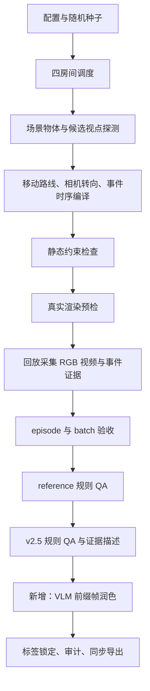

# 原始数据与代码链路梳理

核查时间：2026-09-18。原工程与数据目录（相对于工程上级目录）：

```text
STORM
└── output/sim_qa300_four_scene_balanced_natural_evidence_v25_exp2_20260825_180341
```

源码取自原工程工作树，包含尚未提交的四场景和 v2.x QA 代码；文件校验值见 `source_manifest.json`，清单使用相对源码路径。

## 数据集实况

| 项目 | 数值 |
|---|---:|
| 视频 / episode | 28 |
| 厨房 / 客厅 / 卧室 / 浴室 | 各 7 段、75 题 |
| QA | 300 |
| known / uncertain | 245 / 55 |
| 四个答案位置 | 各 75 |
| current_state / factual_retrieval | 54 / 54 |
| history_aggregation / state_change | 51 / 51 |
| object_tracking / temporal_reasoning | 50 / 40 |

采样时间按 1 FPS 编号，原始视频为 20 FPS。每题记录 `query_time` 与 `evidence_spans`，评测时只允许读取时间不晚于查询点的帧。

`summary.json` 中仍有静态通过、动态待评的旧状态；单独的 `release_status.json` 记录原版本后来通过动态门槛。这是文件生成时间不同，不能只看 summary 判断历史最终状态。新生成或 VLM 润色数据不会继承该动态通过结论。

## 主链路



### 1. 四场景调度

`stream_eqa/four_scene_rollout.py` 划分厨房 `FloorPlan1–30`、客厅 `201–230`、卧室 `301–330`、浴室 `401–430`。它对每个房间生成有效配置，再调用 `benchgen.cli → BatchGenerator.run()`。

每种房间有自己的 surface、观察距离、运动速度、目标像素阈值等覆盖项。因此仅看 YAML 不能代表最后运行参数；`raw/<room>/effective_config.yaml` 才是实际参数记录。四个房间使用按房间偏移后的 seed。

### 2. 场景与视点探测

`adapters/ai2thor.py` 创建 Controller；`Ai2ThorSceneProfiler` 筛选支持面上的可拾取物体，并调用 `ego_station.find_ego_stations()` 寻找能看清目标且能转开视线的观察站位。

实例分割用于计算目标像素、边界框、边缘距离等可见性证据。站位间通过 `GetShortestPathToPoint` 验证导航边，形成 `scene_profile.json`；profile 缓存减少重复探测。

### 3. 路线与事件编译

`compiler/pipeline.py` 组织 `motion/planner.py`、`camera/planner.py`、`events/planner.py`，把路线、转向、观察窗口与事件编译为 `episode_plan.json` 中的稠密轨迹。

主要事件为 `presence_change/{disappear, appear}`，出现／消失按状态安全配对。模拟器在视线转开时改变物体状态，再用前后可见帧验证。视频记录的是视线之外的状态变化。具体操作方式、物体离开后的去向和实例身份，按可见证据判断是否可知。

### 4. 验证与回放采集

`validation/static.py` 检查时间、轨迹速度、覆盖与事件约束。`runtime/replay.py::ThorReplay` 先做渲染预检，再按轨迹执行 `TeleportFull` 等动作并采集帧；同时保存计划、执行 trace、可见性证据、正常视频和高亮诊断视频。

`orchestrator/batch.py` 管理阶段失败、候选种子重试与场景替换。只有通过 episode 和 batch 验收的样本进入 QA。QA/VLM 应使用正常 RGB 视频，高亮视频用于调试。

### 5. 从执行证据建立规则 QA

`stream_eqa/event_adapter.py::build_events()` 把 plan、trace、profile 转为带有目标、事件顺序和时间区间的事件表。

`reference_qa.py::export_run()` 按六类问题、known/uncertain 配额、每段题数及答案位置分配生成 reference QA。`four_scene_rollout._balanced_source_order()` 再确保每个房间正好 75 题。

v2.5 最终 QA 的配置复用链为：

```text
balanced_natural_evidence_qa_exp2
  → balanced_natural_evidence_qa
  → natural_unique_qa / visual_contrast_qa_exp2 / visual_grounded_qa
  → 其他基础 builder、reference_qa、event_adapter
```

这些模块通过 `_configure_base()` 配置共享 builder；发布入口在独立进程调用，避免多配方在同一 Python 进程互相污染。它们根据原始事件重新建题，而不是让语言模型自由出答案。

v2.5 保留 current_state 的 33 条 known 房间识别题，以及 factual_retrieval 的 32 条 known 房间识别题；其他对应题使用局部物体事件。这个配额来自原数据的难度调整，保留以复用原配方，不代表在其他模型上仍有相同准确率。

原始 `natural_unique_qa.py` 与 `balanced_natural_evidence_qa.py` 通过模板组合实现问题自然化、去重与逐题 evidence 文本。这条原始源码链路未调用 VLM API。

### 6. 新增 VLM 润色层

`scripts/polish_qa.py` 读取每题原始文字、只到 query_time 的 RGB 帧，以及供编辑使用的私有标签。返回 schema 只允许文字编辑结果与 `keep/rewrite/flag`。

润色保留 options 数组和 answer_index，只更新 question 与 video_evidence。改写后的语义需另外检查。

对无法确定、证据冲突、缺少必要观察的题，VLM 可以 flag；原题保留在完整数据集中，审计记录指出待检查项。各题处理状态保存在审计记录中。

## 字段与使用边界

| 字段 | 来源 / 用途 |
|---|---|
| `id`, `episode_id` | 关联视频、题目及审计 |
| `query_time` | 允许观察到的时间边界 |
| `question`, `options` | 被测模型的题面；润色只可改 question |
| `answer_index` | 规则真值，仅用于编辑/评价，不进入评测 prompt |
| `evidence_spans` | 原始证据时间范围；润色不可改变 |
| `video_evidence` | 私有自然语言证据说明；不能泄漏进被测模型输入 |
| `diagnostics` | known/uncertain 与来源标签；不可让 VLM 改写 |
| `diagnostic_rationale`, `change_intensity` | 私有诊断与变化强度 |

`model_inputs.jsonl` 通过白名单构造，只含 question_id、episode_id、video_path、query_time 和题面 prompt。不要直接把整个 QA JSON、VLM 请求预演或审计日志交给被测模型。

## 相比原工程的整理项

1. 抽取核心依赖与原 AI2-THOR SDK，不打包原数据、模型权重、Unity 二进制、服务器脚本或密钥。
2. 用可配置入口替代固定服务器路径、固定 GPU 与强制取消代理的启动脚本。
3. 固定原 Unity commit；保留本地 executable 覆盖方式，并修复 SDK 对本地 CloudRendering 的平台选择。
4. 发布入口直接导出 v2.5；报告只写当前静态验证，移除新导出 manifest 中夹带的历史实验得分。
5. 视频跨盘 hardlink 失败时自动 copy。
6. 补充可独立接 API 的 VLM 阶段与失败保护，生成完整且可搬迁的润色数据包。

使用原始 rollout 证据重新导出的 `questions.jsonl` 与原最终文件逐字节一致。
